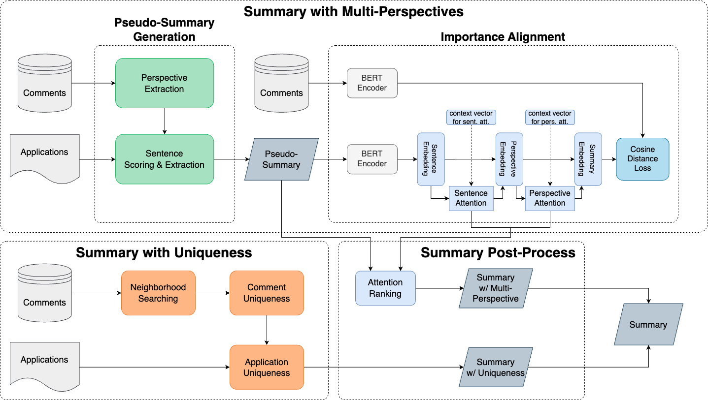

# College_Application_Summarization

Document summarization has raised attention due to the growing demand for condensing huge amounts of text data in different domains. General summarization systems aim at generating summaries for general readers with high coverage, readability, and factuality. However, these systems might fall short to summarize domain-specific documents because the target readers and the focused criteria are different. 

In this research, we focus on generating summaries for college applications to assist the review process. We propose to leverage a comment dataset as a reference dataset to generate summaries with multi-perspective information from the application. Moreover, the unique information that rarely appears in the application is included in the summary by inverse application frequency and committee consensus.

Our system demonstrates a 10\% performance boost compared to ChatGPT in quantitative experiments and surpasses ChatGPT by 0.3 out of 5 on the questionnaire. 70\% of human evaluators express a preference for summaries generated by our system over those produced by ChatGPT.

## Datasets
- **Application dataset**: The document we want to summarize, no golden summary provided.
- **Comment dataset**: Highlights of applicant which are written by the committee after the review process. This dataset is used to extract multi-perspective and unique information from the application.

## Framework

- Summary with multi-perspective
- Summary with uniqueness
- Summary post-process

## Experimental Resutls

### Quantitative Experiments

Compare summary with comments.

| Method  | ROUGE-1  | ROUGE-2 | ROUGE-N | BERTScore  |
|:---:|:---:|:---:|:---:|:---:|
|  ChatGPT  | 0.1263  |  0.0384  | 0.0791  |  0.5683 |
| **Ours**  | **0.1356**  |  **0.0430**  | **0.0866**  |  **0.5720** |

### Human Evaluations
| Method  | Coverage  | Diversity  | Uniqueness  | Convenience  | Overall Preference |
|:---:|:---:|:---:|:---:|:---:|:---:|
| ChatGPT     | 3.54  | 3.22  | 3.27  | 3.41  | 4   |
| **Ours**    | **3.74**  | **3.60**  | **3.60**  | **3.63**  | **9**   |
| Difference  | 0.20  | **0.38**  | **0.33**  | 0.22  | 13  |

- **Coverage**: important information of the application
- **Diversity**: include multi-perspective information of the application
- **Uniqueness**: contain unique information about the application
- **Convenience**: usefulness to assist the review process
- Overall Preference: system preference between ChatGPT and our system

## Tools
- Pytorch
- Scikit-learn
- [HDBSCAN](https://hdbscan.readthedocs.io/en/latest/index.html): hierarchical clustering algorithm to extract multi-perspectives from the comments
- [BERTopic](https://maartengr.github.io/BERTopic/index.html): topic modeling pipeline
- [Articut](https://api.droidtown.co/): a linguistic rule-based tool for Traditional Chinese word segmentation and part of speech tagging

## Thesis
The original thesis for this implementation can be found at this [link](https://ndltd.ncl.edu.tw/cgi-bin/gs32/gsweb.cgi/login?o=dnclcdr&s=id=%22111NTHU5394015%22.&searchmode=basic).

## Copyright Cliam
Copyright (c) Yi-Zhen, Zhang, 2023

**Important Note**: This project is protected by copyright law. You are permitted to view and fork the repository for personal use. However, no license or permission is granted for any other use, including but not limited to reproduction, distribution, or modification of the code, without the express written consent of the copyright holder.
